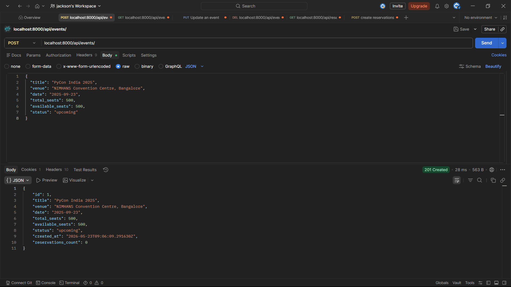
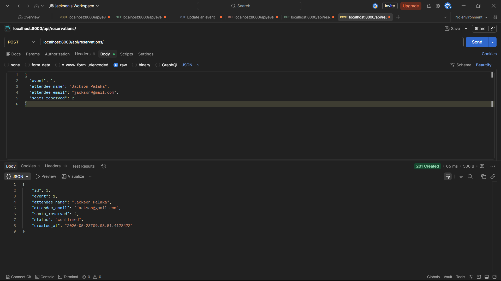
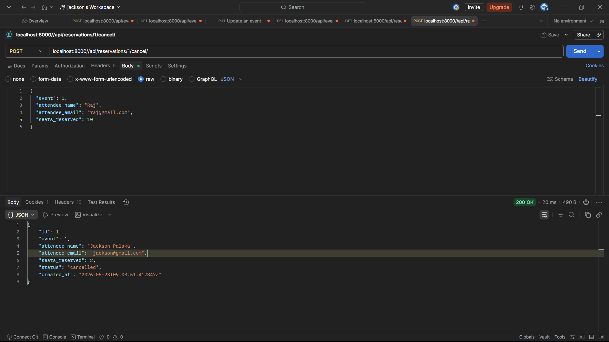
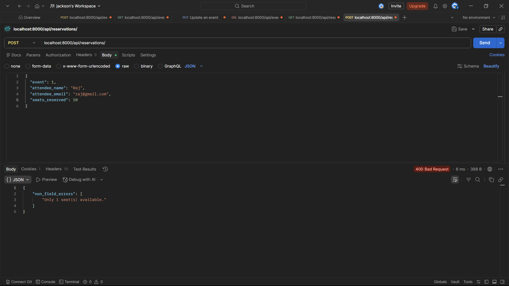

# EventHub - Event Ticketing Backend API

## 📌 Project Overview

EventHub is a backend API built using Django and Django REST Framework that simulates a simplified event ticketing platform.

Users can:

- Browse events
- Reserve seats for events
- Cancel reservations
- Filter events and reservations

The project also handles seat availability validation to prevent overbooking during reservations.

---

## 🏗️ Tech Stack

- Python
- Django
- Django REST Framework (DRF)
- SQLite3

---

## 📂 Project Structure

```bash
eventhub/
│── manage.py
│── db.sqlite3
│── requirements.txt
│
├── eventhub/
│   ├── settings.py
│   ├── urls.py
│   ├── asgi.py
│   └── wsgi.py
│
├── events/
│   ├── migrations/
│   ├── models.py
│   ├── serializers.py
│   ├── views.py
│   ├── urls.py
│   ├── middleware.py
│   └── admin.py
```

---

## 🚀 How to Run the Project

### 1. Clone Repository

```bash
git clone https://github.com/JacksonPalaka/EventHub.git
cd EventHub
```

---

### 2. Create Virtual Environment

```bash
python -m venv venv
```

### Activate Virtual Environment

#### Windows

```bash
venv\Scripts\activate
```

#### Mac/Linux

```bash
source venv/bin/activate
```

---

### 3. Install Dependencies

```bash
pip install -r requirements.txt
```

If requirements.txt is missing:

```bash
pip install django djangorestframework
```

---

### 4. Run Migrations

```bash
python manage.py makemigrations
python manage.py migrate
```

---

### 5. Run Server

```bash
python manage.py runserver
```

Server will run at:

```bash
http://127.0.0.1:8000/
```

---

## 📡 API Endpoints

## 🎟️ Event Endpoints

### Create Event

```http
POST /api/events/
```

### Get All Events

```http
GET /api/events/
```

### Get Single Event

```http
GET /api/events/{id}/
```

### Filter Events By Status

```http
GET /api/events/?status=upcoming
```

### Filter Events By Venue

```http
GET /api/events/?venue=bangalore
```

### Update Event

```http
PUT /api/events/{id}/
```

### Delete Event

```http
DELETE /api/events/{id}/
```

---

## 🎫 Reservation Endpoints

### Create Reservation

```http
POST /api/reservations/
```

### Get All Reservations

```http
GET /api/reservations/
```

### Get Reservation By ID

```http
GET /api/reservations/{id}/
```

### Filter Reservations By Event

```http
GET /api/reservations/?event_id=1
```

### Cancel Reservation

```http
POST /api/reservations/{id}/cancel/
```

---

## 📝 Sample API Requests

## Create Event

### POST `/api/events/`

```json
{
  "title": "PyCon India 2025",
  "venue": "NIMHANS Convention Centre, Bangalore",
  "date": "2025-09-20",
  "total_seats": 500,
  "available_seats": 500,
  "status": "upcoming"
}
```

---

## Create Reservation

### POST `/api/reservations/`

```json
{
  "event": 1,
  "attendee_name": "Priya Sharma",
  "attendee_email": "priya@example.com",
  "seats_reserved": 2
}
```

---

## ✅ Successful Response (201 Created)

```json
{
  "id": 1,
  "event": 1,
  "attendee_name": "Priya Sharma",
  "attendee_email": "priya@example.com",
  "seats_reserved": 2,
  "status": "confirmed",
  "created_at": "2025-03-30T10:00:00Z"
}
```

---

## ❌ Overbooking Response (400 Bad Request)

```json
{
  "non_field_errors": [
    "Only 1 seat(s) available."
  ]
}
```

---

## 🔄 Cancel Reservation

### POST `/api/reservations/1/cancel/`

No request body required.

Returns updated reservation with:

```json
{
  "status": "cancelled"
}
```

---

## 🧠 Design Decisions

### 1. Seat Deduction Inside Serializer

The reservation logic deducts seats directly inside the `create()` method of `ReservationSerializer`.

This ensures:

- Reservation creation and seat deduction happen together
- Business logic remains centralized
- Cleaner and more maintainable code

---

### 2. Custom Cancel Action Using DRF @action

Used DRF's `@action` decorator for reservation cancellation.

Benefits:

- Cleaner REST API design
- Easy custom endpoint creation
- Keeps logic inside ViewSet

---

### 3. Request Logging Middleware

Implemented custom middleware to log:

- Request method
- URL path
- Response status code
- Request processing time

This helps in debugging and monitoring API performance.

---

## 🧪 Testing Checklist

- [x] Create an event
- [x] List all events
- [x] Filter events by status
- [x] Filter events by venue
- [x] Create reservation
- [x] Seats deducted after reservation
- [x] Prevent overbooking
- [x] Cancel reservation
- [x] Restore seats after cancellation
- [x] Filter reservations by event_id
- [x] Middleware logs request details

---

## 🖼️ Postman Testing

## ✅ Success Case

```md





```

---

## ❌ Failure Case

```md

```

---

## ⚙️ Middleware Logging Example

```bash
GET /api/events/ - 200 - 0.02s

POST /api/reservations/ - 201 - 0.05s
```

---

## 📌 Features Implemented

- Django ORM models
- DRF Serializers
- ModelViewSet APIs
- Filtering using query parameters
- Custom DRF action
- Middleware logging
- Reservation validation
- Seat availability management
- RESTful routing using DefaultRouter

---

## 👨‍💻 Author

Jackson Palaka

GitHub: https://github.com/JacksonPalaka